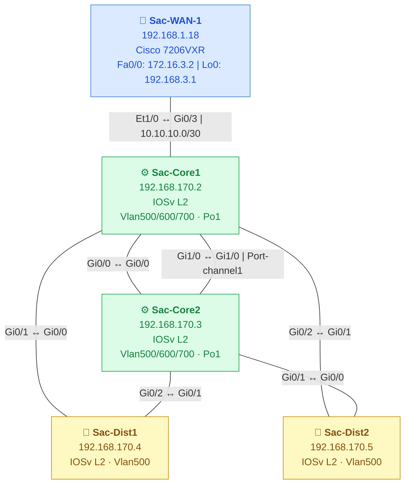

# Sacramento Network Topology

> Discovered via CDP · Jump server `192.168.1.90` · 5 Cisco IOS devices

---

## Network Diagram

---

## Device Inventory

| Hostname     | Mgmt IP          | Platform        | Role         | Active Subnets / VLANs                                          |
|--------------|------------------|-----------------|--------------|------------------------------------------------------------------|
| Sac-WAN-1    | `192.168.1.18`   | Cisco 7206VXR   | WAN Edge     | Fa0/0: 172.16.3.2 · Et1/1: 192.168.1.18 · Lo0: 192.168.3.1 · Tu0, Tu1 |
| Sac-Core1    | `192.168.170.2`  | IOSv L2         | Core         | Vlan500: 192.168.170.2 · Vlan600: 192.168.169.2 · Vlan700: 192.168.171.2 |
| Sac-Core2    | `192.168.170.3`  | IOSv L2         | Core         | Vlan500: 192.168.170.3 · Vlan600: 192.168.169.3 · Vlan700: 192.168.171.3 |
| Sac-Dist1    | `192.168.170.4`  | IOSv L2         | Distribution | Vlan500: 192.168.170.4                                          |
| Sac-Dist2    | `192.168.170.5`  | IOSv L2         | Distribution | Vlan500: 192.168.170.5                                          |

---

## CDP-Verified Links

| Device A    | Interface A          | Device B    | Interface B          | Subnet / Notes               |
|-------------|----------------------|-------------|----------------------|------------------------------|
| Sac-WAN-1   | `Ethernet1/0`        | Sac-Core1   | `GigabitEthernet0/3` | `10.10.10.0/30` – WAN uplink |
| Sac-Core1   | `GigabitEthernet0/0` | Sac-Core2   | `GigabitEthernet0/0` | Inter-core link A            |
| Sac-Core1   | `GigabitEthernet1/0` | Sac-Core2   | `GigabitEthernet1/0` | Inter-core link B → Port-channel1 |
| Sac-Core1   | `GigabitEthernet0/1` | Sac-Dist1   | `GigabitEthernet0/0` | Core1 → Dist1                |
| Sac-Core2   | `GigabitEthernet0/2` | Sac-Dist1   | `GigabitEthernet0/1` | Core2 → Dist1 (redundant)    |
| Sac-Core1   | `GigabitEthernet0/2` | Sac-Dist2   | `GigabitEthernet0/1` | Core1 → Dist2                |
| Sac-Core2   | `GigabitEthernet0/1` | Sac-Dist2   | `GigabitEthernet0/0` | Core2 → Dist2 (redundant)    |

---

## Topology Notes

- **Hierarchical design** — WAN Edge → Dual Core → Dual Distribution
- **Sac-Core1 & Sac-Core2** are bonded via **Port-channel1** (two physical links: Gi0/0 + Gi1/0)
- **Sac-Dist1 & Sac-Dist2** are both **dual-homed** to Core1 and Core2 — full redundancy at the distribution layer
- VLANs 800, 802, 900 exist on the core switches but are administratively down
- Sac-WAN-1 has two active tunnels (Tu0, Tu1) — likely VPN/GRE toward remote sites
